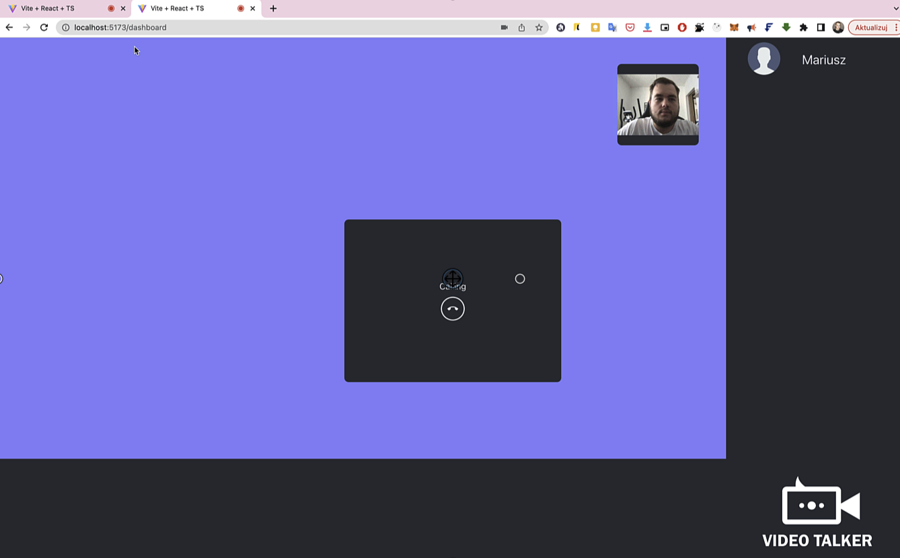

# WebRTCExpress - Komunikator z Wideo-Rozmowami


## Opis
WebRTCExpress to komunikator z wideo-rozmowami, który opiera się na technologii WebRTC. Projekt powstał na podstawie kursu, ale zostały wprowadzone własne zmiany, aby dostosować go do indywidualnych potrzeb. Zajmowałem się implementacją interaktywnych funkcji oraz byłem odpowiedzialny za integrację front-endu napisanego w React i Vite z back-endem opartym na Express i Socket.io. Warto zaznaczyć, że oryginalny kurs był napisany w JavaScript i korzystał z Webpack, natomiast ten projekt korzysta z TypeScript i Vite.



## Technologie
- React
- TypeScript
- Vite
- Redux
- Websocket.io
- react-router-dom
- Express
- Socket.io

## Funkcjonalności
- Rozmowa video 1 na 1
- Rozmowa video grupowa
- Pisanie wiadomości
- Możliwość pokazywania ekranu zamiast korzystania z kamery

## Wymagania
Projekt wymaga jedynie środowiska Node.js do uruchomienia.

## Instalacja i uruchomienie
1. Zainstaluj wszystkie zależności za pomocą komendy:

```bash
pnpm install
```
2. Uruchom backend.
3. Uruchom projekt lokalnie za pomocą:


```bash
  pnpm run dev
```